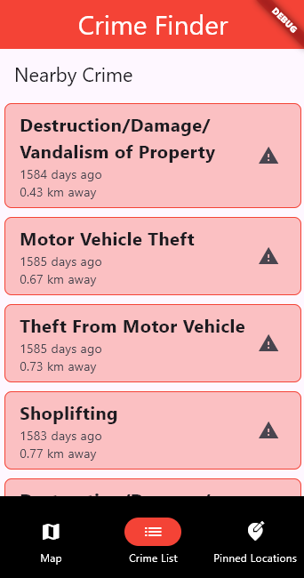
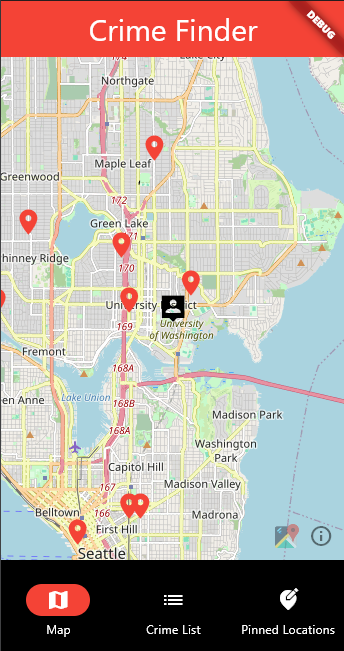
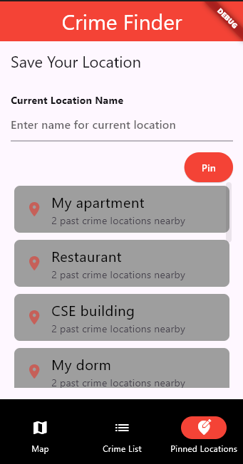

# final_project

## Name

Crime Finder App

## Description
Our current crime finder app is more of a improvement over the UW crime alert, where UW students are notified about a crime taking place somewhere near the campus. Our app is to expand this to the greater seattle area and showing the crime locations, how far away they are from it and time they took place through a list view. Crime locations can also be viewed through a google map, where a user is able to visuals crime that have taken place in the area. Lastly we have a pin location which pins your current location and saves the data in list which can be accessed later since it is persistent. The pinned location can also show nearby crimes that have happened in that area. 

Here is a quick list of features our app performs:
- Discover local crime incidents in your area, including theft, vandalism, and more, right on your smartphone.
- View crimes happening in your vicinity on an interactive google map.
- Pin current location and find nearby crimes
- Empower yourself and your community to stay safe. 

## Badges

## Visuals

    
    
    

## Installation

1. Installing Flutter and Dart and verify you are meeting all requirements in the installation by running the following in your terminal: flutter doctor
2. Download code through zip file and/or clone repository git clone https://github.com/your_username/final_project.git. For cloning repository, access token may be required. 
3. Navigate to the project directory: cd final_project
4. Install dependencies by running the following in terminal: flutter pub get
5. Run the app on your device or emulator by running the following in terminal: flutter run

## Usage

For proper usages follow these steps:
- Create a git clone, if necessary or download file as zip file
- cd crime_finder-main
- flutter pub get 
- flutter run

After running these steps this should open the Crime Finder App which allows users to:
- View local crime data on a map interface
- Browse a list of crimes with details such as how far away it is, type of crime, and date of when it occured. 
- Pin locations of interest for future reference

## Support

For help feel free to contact one of Contributors via email:
Karan Hanswadkar - karanh21@uw.edu, 
Elise Poniman - elise03@uw.edu, 
Calvin Tsai - ctsai7@uw.edu, 

## Roadmap

One main idea that we had in the future is to include a notification feature, where users who are using the app on the phone would be sent a notification on whether they are in close proximity to a crime locations. Other ideas that we would want to implement include using real-time and live crime data within the previous few days, and this might perhaps be done using a pay-to-use API, and thus if our app gets funding we can use these funds for the live crime data APIs. Another feature that we would want to improve further is the map feature, as we would want to make this more accessible to all users and this may require rather than using the flutter map, is to create our own map layout, that is compatible with talkback feature and custom zoom in/out options. We could also create a pin location feature like in our app, in the map feature, and users can pin multiple locations on the map, however this would likely require us to create our own map layout. 

## Contributing

At the moment we are not open to public contributions to our main code, as it may deal with sensitive data information that we would not want bad actors to have access to or we would not want to potentially alter the data and spread misinformation. 

## Authors and acknowledgment

Contributors:
Karan Hanswadkar, Elise Poniman, Calvin Tsai 

## License

No license, as we want to have this be a closed project since we have sensitive information and we don't want our data to be altered. We may decide to later after further development if we want it to be open source. 

## Project status

Development of Crime Finder App is ongoing and at the moment we are not allowing contributions to our main code. However soon if we decide to make the project open source, we would want our code to be publically available and we welcome suggestions and feedback from the community to improve the app further.
